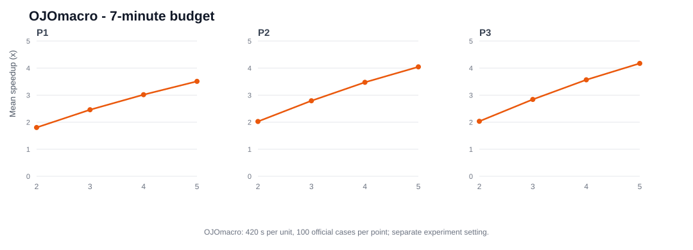

# 2026 华为杯 A 题：多核 NPU 切图与调度

本仓库收录本人在 **2026 年中国研究生数学建模竞赛（华为杯）A 题**中开发的三条算法路线：**V2plus、RAMPplus、OJOmacro**。参赛队友也独立开发了其他算法，团队通过实验比较最终选定 OJOmacro 作为主要方案，并合作完成参赛论文。

赛题要求对通用 NPU 计算图进行多核切图与 Task 调度，在满足依赖和存储约束下缩短总执行时间（Makespan）。切分与排程需要兼顾计算并行、DDR 搬运、跨核同步及缓存复用。下文将三个硬件场景记为 P1、P2、P3。

## 算法路线

### V2plus

从自然模块生成不同粒度的 Task 分区，按 Pipe 负载、Tensor 亲和与拓扑连续性构造候选，再用时间、搬运和 L1/UB 风险代理排序。侧重结构化候选生成。[代码](src/algorithms/v2plus/algorithm.py) · [说明](docs/V2plus_算法设计.md)

### RAMPplus

在自然模块 DAG 上多级粗化，并根据官方验证方案的时间线尝试 split、merge、move、reorder 邻域。侧重模块层级搜索与评估反馈。[代码](src/algorithms/rampplus/algorithm.py) · [说明](docs/RAMPplus_算法设计.md)

### OJOmacro

从原始 Op 的依赖和 Tensor 关系出发，组合多尺度分区、结构性 macro 候选与 Op 级局部搜索；对已验证方案继续生成邻域，并按场景筛选候选。侧重原始 Op 粒度的切图与调度联合改进。[搜索代码](src/algorithms/ojomacro/search.py) · [macro 候选](src/algorithms/ojomacro/macro.py) · [说明](docs/OJOmacro.md)

三条路线共用 [运行入口](scripts/run_all_problems.py)及必要的图解析、排程和评估适配模块，均支持 P1–P3。模块职责见 [代码结构](docs/ARCHITECTURE.md)。

## 实验结果

### 三算法早期同预算比较

[旧预算记录](results/old_budget_units.csv)覆盖 100 例、P1–P3、2–5 核。原 CSV 的运行时间最高约 300.4 秒；旧运行器默认每配置 300 秒，`overnight` 预设常规官方候选额度为 8 次，P3 可额外进行一次 P2 同方案参照评估。队友的完整启动命令未留存，可能被覆盖的细项见 [统计口径](results/METHODS.md)。

下表为 **P2/P3 有效样本的平均加速比**；括号为有效数，每格请求 100 例。有效数包含 `PASS` 和已有官方合法方案的 `PARTIAL_PASS_BUDGET`；`TIMEOUT` 不计入均值。完整 P1 数据、官方 Makespan 与额外 DDR 搬运量见 [分组汇总](results/old_budget_summary.csv)。

| 场景 | 核数 | V2plus | RAMPplus | OJOmacro |
| --- | ---: | ---: | ---: | ---: |
| P2 | 2 | 1.821 (95) | 1.879 (95) | **1.981 (98)** |
| P2 | 3 | 2.503 (95) | 2.577 (95) | **2.741 (97)** |
| P2 | 4 | 3.143 (95) | 3.208 (95) | **3.411 (98)** |
| P2 | 5 | 3.638 (95) | 3.731 (95) | **3.965 (98)** |
| P3 | 2 | 1.840 (95) | 1.888 (95) | **1.986 (98)** |
| P3 | 3 | 2.538 (95) | 2.593 (95) | **2.775 (98)** |
| P3 | 4 | 3.195 (95) | 3.244 (95) | **3.482 (98)** |
| P3 | 5 | 3.714 (95) | 3.794 (95) | **4.074 (98)** |

三路线在全部 1200 个请求配置中的有效数分别为 **1135、1133、1165**。OJOmacro 在 P2/P3 的各核数有效样本均值与覆盖率较好；P1 并非如此，例如 5 核均值为 V2plus **3.503**、RAMPplus **3.523**、OJOmacro **3.439**（有效数分别为 95、93、96）。

按非 COPY 计算 Op 数选取最大的 25 张图（至少 7360 Op），OJOmacro 在 P2 的共同有效配置上相对 RAMPplus 为 **46 胜／7 平／18 负**，P3 为 **49 胜／6 平／17 负**；胜负以官方 Makespan 为准。[规模分组数据](results/old_budget_large_graph_pairs.csv)另列 P1 与 V2plus 的配对结果。上述比较支持将 OJOmacro 作为 P2/P3 和大图场景的展示重点。

### OJOmacro 最终 420 秒实验

最终论文归档中的 `example.tex` 记录：每个“用例 × 问题 × 核数”配置预算 **420 秒**，不设官方评估调用总次数上限。P1–P3、2–5 核均有 100 个官方通过的合法结果；表中为逐例加速比在 100 例上的算术平均。

| 核数 | P1 加速比 | P2 加速比 | P3 加速比 | P3 Cache / 无 L2 | P3 平均命中率 |
| ---: | ---: | ---: | ---: | ---: | ---: |
| 2 | 1.804 | 2.025 | 2.034 | 1.0046 | 17.46% |
| 3 | 2.459 | 2.792 | 2.842 | 1.0178 | 24.01% |
| 4 | 3.016 | 3.473 | 3.566 | 1.0307 | 24.69% |
| 5 | **3.509** | **4.046** | **4.172** | 1.0380 | 26.71% |



`Cache / 无 L2` 为逐例 P2/P3 Makespan 比值的均值。[公开摘要](results/ojo_7min_summary.csv)与旧预算数据属于**不同实验配置**，不作同预算排名。

## 运行

建议 Python **3.11+**；默认求解仅用标准库，OJO 的 CP-SAT 研究分支可选装 OR-Tools（见 [requirements.txt](requirements.txt)）。仓库不包含官方计算图、配置、评估器或原始附件。请通过竞赛主办方授权渠道获取附件，将包含 `data/` 和 `code/` 的根目录放在仓库外，通过 `--official-root` 或 `MATH_MODEL_OFFICIAL_ROOT` 指定。

从仓库根目录运行一个 OJOmacro 配置：

```bash
python scripts/run_all_problems.py --official-root "/path/to/official-attachment" --cases 001 --cores 2 --problems 1 --algorithms OJOmacro --profile overnight --per-case-seconds 420 --max-candidates 0 --per-eval-seconds 120 --output-dir "/path/to/local-output"
```

在命令末尾加 `--dry-run` 可只检查任务选择。`--max-candidates 0` 对 OJOmacro 表示无官方评估**总次数**上限；`--per-eval-seconds` 限制单次评估，`--per-case-seconds` 限制单配置总时间。时间耗尽时保留检查点中的最佳合法 Plan。V2plus/RAMPplus 可通过 `--algorithms` 选择，参数见 `python scripts/run_all_problems.py --help`。

输入为官方 JSON 计算图（`ops`、`tensors`、`edges`）及配置，输出 Plan 包含 `node_to_subgraph` 和 `core_schedules`。无需官方附件的合成图检查：`python scripts/smoke_test.py`。

## 项目结构

```text
.
├── src/
│   ├── algorithms/  # V2plus、RAMPplus、OJOmacro 与统一路由
│   └── common/      # 图、分区、排程、内存、官方评估适配
├── scripts/   # 运行、已验证方案导出、合成图检查
├── docs/      # 算法说明
├── results/   # 脱敏实验摘要与统计口径
└── figures/   # OJOmacro 最终实验图
```

本项目采用 [MIT License](LICENSE)。实验数据来源与统计口径见 [METHODS.md](results/METHODS.md)。

